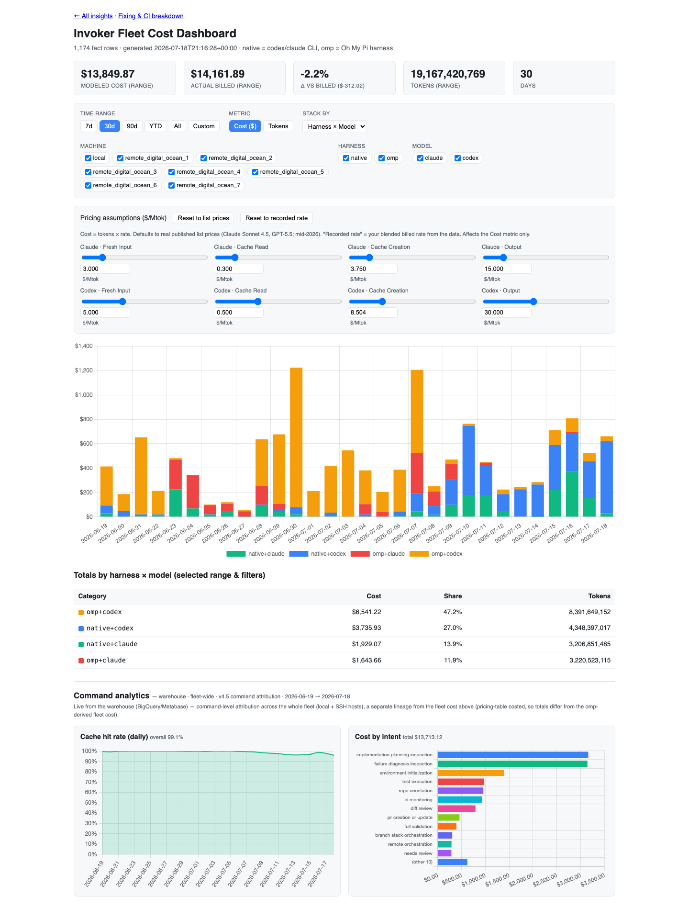
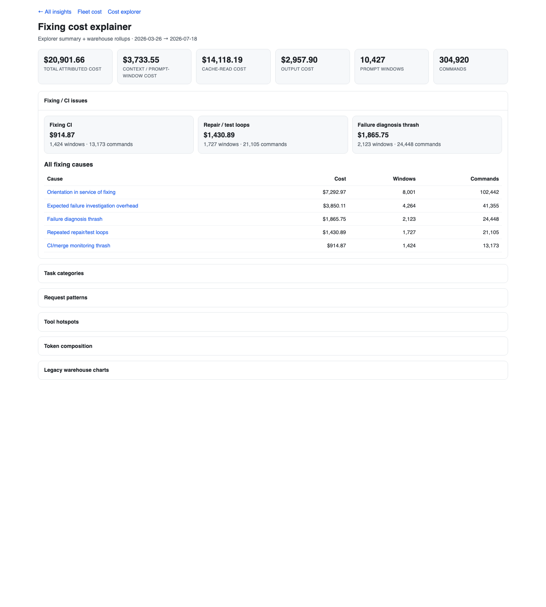
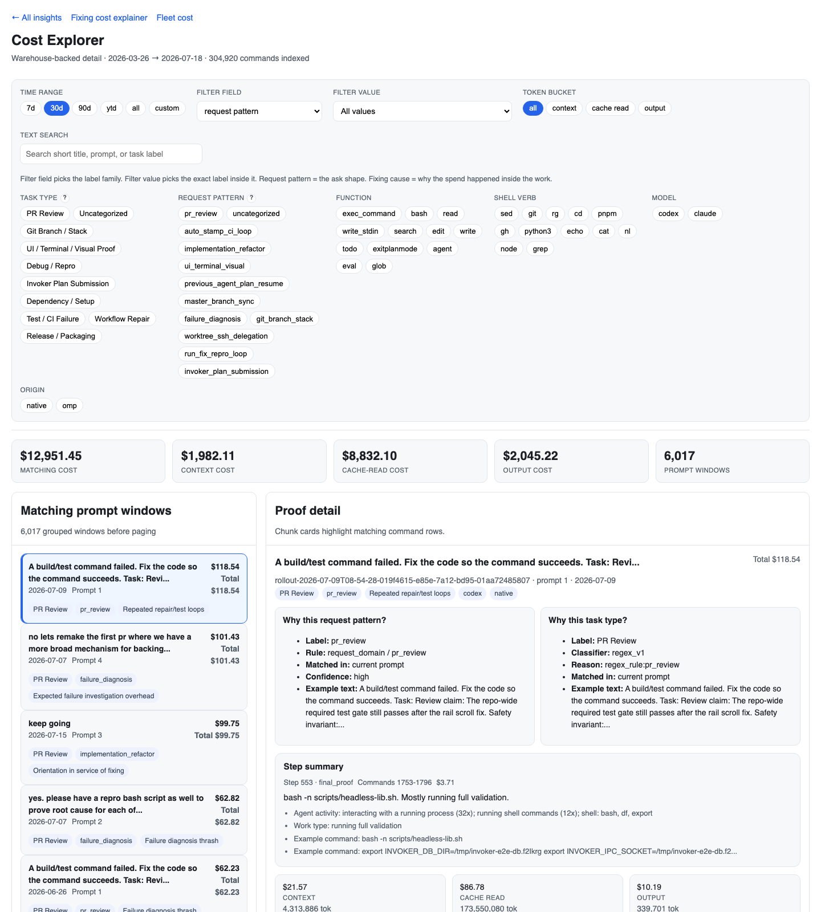
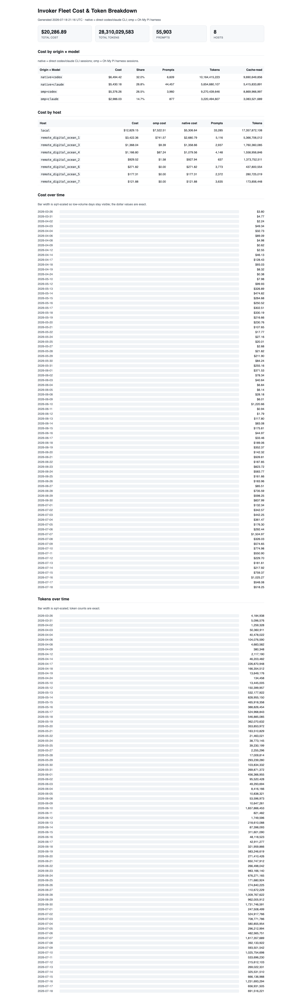

# session-metrics

Session analytics for nightly usage metrics, warehouse publishing, and Invoker benchmark runs.

This repository collects Codex/Claude session usage across local and SSH hosts, computes cache-hit and planning-vs-execution reports, exports replay-safe events to Mixpanel, and publishes normalized command-cost analytics into warehouse-backed Metabase dashboards.

## Repo Map

- Nightly pipeline: collects session usage, computes cache and attribution reports, and exports Mixpanel events through `scripts/nightly_usage_pipeline.sh`.
- Publishing analytics: exports the normalized warehouse table, loads BigQuery and ClickHouse, and creates Metabase dashboards through `scripts/run-warehouse-analytics.sh`.
- Local insights dashboards: fleet spend, fixing/CI explainer, and cost explorer served by `scripts/run-local-insights.sh` (no Metabase required).
- Benchmark harness: runs the Invoker nightly model/mode benchmark tooling from `invoker-benchmarks/`.

## Local insights dashboards

Serve the HTML dashboards against local fleet facts + BigQuery warehouse panels:

```bash
bash scripts/run-local-insights.sh
# -> http://127.0.0.1:8899/insights
```

| Route | Page |
|---|---|
| `/insights` | Hub |
| `/cost` | Fleet Cost Dashboard |
| `/fixing-cost` | Fixing cost explainer |
| `/cost-explorer` | Cost Explorer (prompt-window search) |
| `/cost-summary` | Static fleet cost summary |

Snapshot from the **2026-07-18** refresh (full numbers in
[`docs/screenshots/insights-2026-07-18/VALUES.md`](docs/screenshots/insights-2026-07-18/VALUES.md)):

### Insights hub


### Fleet cost (`/cost`, default 30d)

| KPI | Value |
|---|---|
| Modeled cost | $13,849.87 |
| Actual billed | $14,161.89 |
| Δ vs billed | −2.2% (−$312.02) |
| Tokens | 19,167,420,769 |
| Cache hit rate | 99.1% |



### Fixing cost explainer (`/fixing-cost`, all-time)

| KPI | Value |
|---|---|
| Total attributed cost | $20,901.66 |
| Context / prompt-window | $3,733.55 |
| Cache-read | $14,118.19 |
| Output | $2,957.90 |
| Prompt windows / commands | 10,427 / 304,920 |

Top cause: Orientation in service of fixing — **$7,292.97**.



### Cost Explorer (`/cost-explorer`)

304,920 commands indexed for 2026-03-26 → 2026-07-18.



### Fleet cost summary (`/cost-summary`)

All-time fleet fact: **$20,286.89** · 28.3B tokens · 55,903 prompts · 8 hosts.



Details and setup: [`docs/cost-dashboard.md`](docs/cost-dashboard.md).

## Nightly Pipeline

1. `scripts/cache_hit_audit.py`
2. `scripts/planning_vs_execution_report.py`
3. `scripts/mixpanel_export_usage.py`

Orchestrated by:

- `scripts/nightly_usage_pipeline.sh`

## Publishing Analytics

The warehouse publishing surface is orchestrated by:

- `scripts/run-warehouse-analytics.sh`

It validates the local command-cost export, loads BigQuery, loads ClickHouse, and creates matching Metabase dashboards.

## Quickstart

1. Copy env file and edit credentials:

```bash
cp config/nightly-usage.env.example config/nightly-usage.env
```

2. Configure source hosts:

```bash
cp config/sources.json config/sources.local.json
```

Then set `USAGE_PIPELINE_SOURCES_CONFIG` in `config/nightly-usage.env` to your local file.

3. Run a dry-run pipeline:

```bash
bash scripts/nightly_usage_pipeline.sh --dry-run --env-file config/nightly-usage.env
```

## Make targets

- `make audit`
- `make report`
- `make export-dry-run`
- `make nightly-dry-run`
- `make warehouse-demo-validate`
- `make test`
- `make benchmark-dry-run`

## Scheduling

- Local launchd scripts:
  - `scripts/install-nightly-usage-launchd.sh`
  - `scripts/uninstall-nightly-usage-launchd.sh`
- Optional GitHub Actions cron:
  - `.github/workflows/nightly-session-metrics.yml`
- Cost dashboard refreshes (workstation crontab):
  - `scripts/install-cost-dashboard-cron.sh` (recommended — one cron, collects the fleet once, does both halves)
  - `scripts/install-fleet-cost-cron.sh` / `scripts/install-warehouse-cron.sh` (split schedules instead)
  - `scripts/archive-fleet-sessions.sh` (opt-in durable backfill archive)
  - `scripts/install-cost-tunnel-launchagent.sh` (macOS tunnel)

## Documentation

- `docs/setup.md`
- `docs/cost-dashboard.md`
- `docs/architecture.md`
- `docs/source-onboarding.md`
- `docs/usage-metrics-nightly.md`
- `docs/operations-backfill.md`
- `docs/run-your-own-analytics.md`
- `docs/warehouse-cost-demo.md`
- `docs/reports/planning-vs-execution-tooling.md`
- `docs/migration-from-invoker.md`
- `docs/invoker-benchmark-nightly.md`

## Backfills and replay-safe dedupe

- Re-submit with deterministic dedupe keys:

```bash
bash scripts/nightly_usage_pipeline.sh --date 2026-05-25 --ignore-local-state --env-file config/nightly-usage.env
```

Mixpanel dedupe is driven by stable `$insert_id` values per logical row.

## Repository Rename Note

If the GitHub repository is renamed to `session-metrics`, GitHub should preserve redirects. After that rename, update local remotes with the new repository URL; script paths, runtime state paths, launchd identifiers, and env var names intentionally remain stable in this pass.

## Provenance

This was extracted from Invoker work tracked in [Neko-Catpital-Labs/Invoker#965](https://github.com/Neko-Catpital-Labs/Invoker/pull/965).
